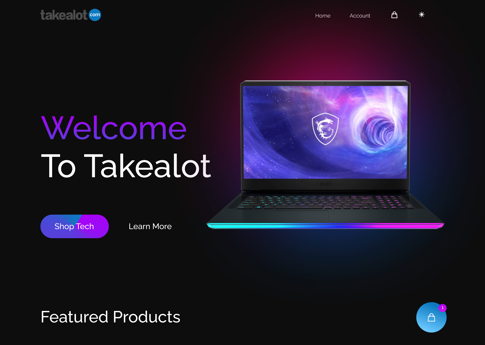

# Next js 13 Ecommerce website

I built this website using Next.js and the MERN stack. Next.js is a
React-based framework that I used to enable server-side rendering
and support static site generation, resulting in faster page loading
times and better search engine optimization. The MERN stack includes
four key technologies - MongoDB, Express.js, React.js, and Node.js,
which I utilized to create a NoSQL database for data storage, a
Node.js framework to build web applications, a JavaScript library to
build user interfaces, and a runtime environment to run JavaScript
on the server-side. Additionally, I designed this Takealot clone
using Figma, a UI/UX design tool that allowed me to create mockups,
prototypes, and user interfaces that are aesthetically pleasing,
easy to navigate, and use and brought the design to life using
Tailwindcss. Together, these technologies enabled me to create a
robust and modern website that provides a seamless shopping
experience to our users.

## Demo

https://next-takealot-ecommerce.vercel.app/

## Technologies Used

- [Next.js 14](https://nextjs.org/)
- [Tailwind CSS](https://tailwindcss.com/)
- [MongoDB](https://www.mongodb.com/)

## Installation

- npm install
